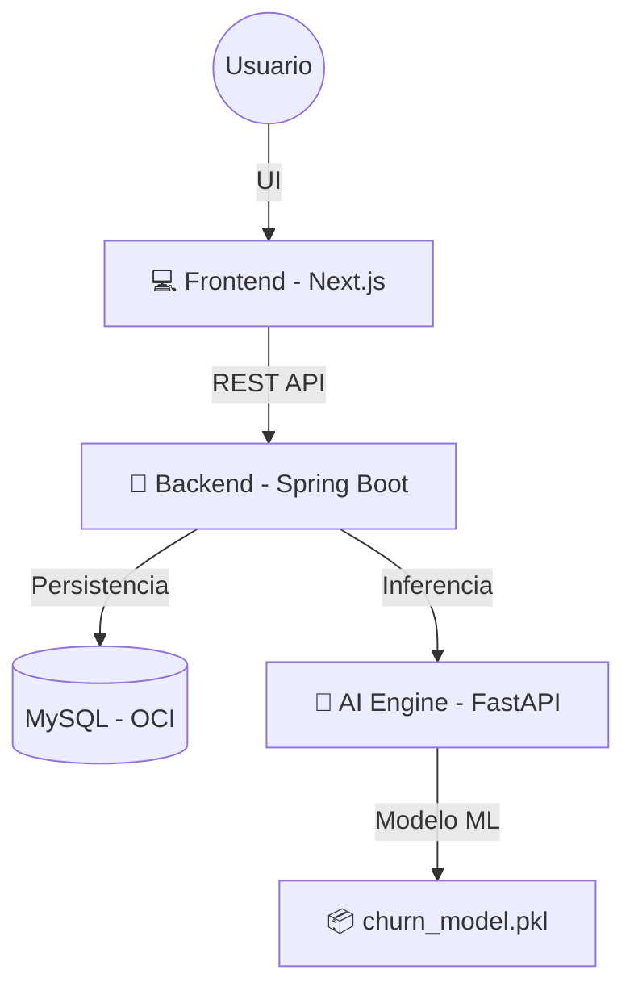

# 🌌 **ChurnInsight — Enterprise Churn Prediction Platform**

[]()
[]()
[]()
[]()
[]()
[]()

> **ChurnInsight** es una plataforma de Inteligencia Artificial diseñada para predecir la fuga de clientes en telecomunicaciones mediante modelos de Machine Learning, una arquitectura modular y capacidades de despliegue en la nube.

---

## 📑 **Tabla de Contenido**

1. [Introducción](#-introducción)
2. [Arquitectura Empresarial](#-arquitectura-empresarial)
3. [Stack Tecnológico](#-stack-tecnológico)
4. [Estructura del Monorepo](#-estructura-del-monorepo)
5. [Instalación y Ejecución](#-instalación-y-ejecución)
6. [Uso del Sistema](#-uso-del-sistema)
7. [API Reference](#-api-reference)
8. [Roadmap](#-roadmap)
9. [Contribuir](#-contribuir)
10. [Licencia](#-licencia)
11. [Autor](#-autor)

---

# 🚀 **Introducción**

ChurnInsight es una solución integral que permite:

* Detectar clientes con alta probabilidad de cancelar servicios.
* Priorizar acciones comerciales usando IA.
* Integrarse con sistemas existentes mediante APIs REST.
* Operar en entornos locales o en la nube (Oracle Cloud / Docker).

Este proyecto fue desarrollado para el **Challenge ONE - No Country 2025**, siguiendo estándares de arquitectura empresarial.

---

# 🏗️ **Arquitectura Empresarial**

Plataforma basada en microservicios híbridos:



### 🔐 Características de arquitectura:

* Aislamiento total entre Frontend, Backend y AI.
* Backend desacoplado con servicios de dominio.
* Motor de IA independiente y versionado.
* Preparado para despliegue en contenedores y CI/CD.

---

# 🛠️ **Stack Tecnológico**

| Capa                | Tecnología                             | Descripción                                     |
| ------------------- | -------------------------------------- | ----------------------------------------------- |
| **AI Engine**       | Python · FastAPI · Scikit-learn        | Entrenamiento, feature engineering y predicción |
| **Backend Core**    | Java 17 · Spring Boot                  | Gestión del negocio, seguridad y reglas         |
| **Frontend**        | Next.js · TailwindCSS                  | Dashboard moderno e interactivo                 |
| **Infraestructura** | Docker · Docker Compose · Oracle Cloud | Contenerización y despliegue                    |

---

# 📁 **Estructura del Monorepo**

```bash
ChurnInsight/
├── ai-ml/                  # Motor de IA
│   ├── data/
│   ├── models/
│   ├── notebooks/
│   └── src/
│
├── backend/                # Microservicio Backend
│   ├── src/main/java/
│   ├── src/main/resources/
│   └── pom.xml
│
└── frontend/               # Dashboard
    ├── src/app/
    ├── src/components/
    └── public/
```

---

# ⚙️ **Instalación y Ejecución**

## 🔧 **Opción A — Entorno Local**

### 1. Clonar repositorio

```bash
git clone https://github.com/gian-pc/ChurnInsight.git
cd ChurnInsight
```

### 2. AI Engine

```bash
cd ai-ml
python -m venv .venv
source .venv/bin/activate   # Windows: .venv\Scripts\activate
pip install -r requirements.txt
```

### 3. Backend

```bash
cd ../backend
./mvnw clean install
```

### 4. Frontend

```bash
cd ../frontend
npm install
```

---

## 🐳 **Opción B — Docker (todo el sistema)**

```bash
docker-compose up --build -d
```

---

# ⚡ **Uso del Sistema**

Ejecutar cada servicio en terminales separadas:

| Servicio      | Comando                                     | Puerto |
| ------------- | ------------------------------------------- | ------ |
| **AI Engine** | `uvicorn src.main:app --reload --port 8000` | 8000   |
| **Backend**   | `./mvnw spring-boot:run`                    | 8080   |
| **Frontend**  | `npm run dev`                               | 3000   |

### Accesos

* Dashboard → [http://localhost:3000](http://localhost:3000)
* API de IA → [http://localhost:8000/docs](http://localhost:8000/docs)

---

# 📡 **API Reference — AI Engine**

## `GET /health`

```json
{ "status": "active", "model_version": "v1.0.2" }
```

## `POST /api/predict`

### Request

```json
{
  "customer_id": "12345",
  "monthly_charges": 70.50,
  "total_services": 3,
  "contract_type": "Month-to-month"
}
```

### Response

```json
{
  "churn_probability": 0.85,
  "risk_level": "High",
  "recommended_action": "Offer discount"
}
```

---

# 🛣️ **Roadmap**

* [x] Modelo de Machine Learning
* [ ] Backend con MySQL + ORM
* [ ] Dashboard Next.js
* [ ] Versionado de modelos
* [ ] Pipeline MLOps
* [ ] Deploy final en OCI con Docker

---

# 🤝 **Contribuir**

1. Fork del proyecto
2. Crear branch de features
3. Crear PR con descripción clara
4. Mantener estilo y calidad de código

---

# 📜 **Licencia**

Este proyecto está bajo la licencia **MIT**.

---

# 👤 **Autor**

**gianpc**  
**Fullstack AI Developer · Machine Learning · Cloud · DevOps**

🌐 [gianpc.com](https://gianpc.com) 